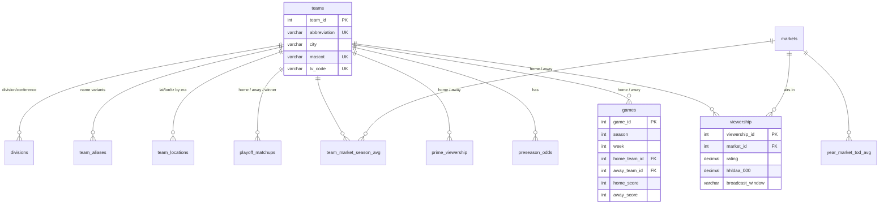

# NFL Viewership Data Pipeline

The foundation of the portfolio: the data engineering that feeds the
[TV-ratings models](../02-tv-ratings-ml/) and everything downstream. This pipeline takes
messy, multi-source NFL broadcast and betting data and turns it into a single, leak-free,
training-ready table through a normalized MySQL warehouse.

> **TL;DR for reviewers:** A star-schema warehouse (5 reference tables, 5 fact tables,
> denormalized views, and derived aggregate tables), fed by an idempotent, dependency-aware
> ingest CLI, and read out by a feature-generation script that handles timezone
> normalization, name reconciliation, and season-lagged features. Roughly 2,400 lines of
> SQL and Python.

---

## Why this exists

The ML modeling projects need one row per (game, market) pair, with dozens of engineered features.
The raw inputs are nothing like that: game results, local Nielsen viewership, primetime
ratings, and preseason betting odds all arrive in separate files with inconsistent team
names, local kickoff times, and no shared keys. This pipeline is the machinery that
reconciles them into a warehouse you can query and extend, rather than a pile of one-off scripts.

---

## Architecture

Three stages, each a directory:

```
schema/     DDL: reference tables, fact tables, views, and derived trend tables
ingest/     Python loaders that populate the warehouse from source files
features/   A read-out script that joins the warehouse into a training CSV
```

Data flows one direction:

```
source files ──▶ ingest/ ──▶ MySQL warehouse (schema/) ──▶ features/ ──▶ training CSV ──▶ models
```

### Warehouse schema



- **Reference tables** (`teams`, `team_aliases`, `team_locations`, `markets`, `divisions`)
  hold the slow-changing dimensions. `team_locations` is season-scoped, so franchise
  relocations (the Chargers and Rams moving to LA, Oakland to Las Vegas) resolve to the
  correct coordinates and timezone for the year in question.
- **Fact tables** (`games`, `viewership`, `preseason_odds`, `prime_viewership`,
  `playoff_matchups`) hold the per-event records, all keyed back to `teams` by integer id.
- **Views** (`v_games`, `v_viewership`, and so on) denormalize the integer keys back to
  human-readable abbreviations for ad-hoc analysis, so day-to-day querying never requires
  hand-writing the same three joins.
- **Derived trend tables** (`year_market_tod_avg`, `team_market_season_avg`) precompute the
  aggregate baselines that later become model features.

Every fact table carries a natural `UNIQUE` constraint (for example
`viewership(season, week, home_team_id, away_team_id, market_id)`), which is what makes
re-ingestion safe.

---

## The ingest layer

[`ingest/ingest_season.py`](ingest/ingest_season.py) loads all five fact tables for a
season, or every season at once:

```bash
python ingest/ingest_season.py 2021           # load one season
python ingest/ingest_season.py 2021 --force   # wipe and reload that season
python ingest/ingest_season.py --all          # load every available season
```

Two design decisions worth calling out:

- **Idempotent by construction.** Without `--force` the script refuses to touch a season
  that already exists. With `--force` it deletes every row for that season across all five
  fact tables and reinserts from scratch. Re-running is always safe and always converges to
  the same state.
- **Dependency-ordered loading.** `viewership` is loaded last, because resolving its home
  and away teams requires looking rows up against the already-populated `games` table. The
  load order (`games`, `preseason_odds`, `prime_viewership`, `playoff_matchups`, then
  `viewership`) is enforced in code and documented in the module docstring.

[`ingest/load_reference_data.py`](ingest/load_reference_data.py) seeds the reference
dimensions (teams, aliases, locations, markets, divisions) and includes the name-alias
reconciliation that lets a single team be matched across sources that spell it differently
(`Washington`, `Redskins`, `Commanders`, `WSH`).

---

## The feature layer

[`features/generate_dataset.py`](features/generate_dataset.py) reads the warehouse and
emits the training CSV the models consume. The non-obvious work happens here:

- **Timezone normalization.** Kickoff `start_time` is stored in the market's local time.
  The script parses `"H:MM AM/PM"`, shifts by each market's `timezone_offset`, and derives
  a canonical Eastern time, from which `timeofday`, `hour_est`, `month`, and `year` follow.
  A 1:00 PM Pacific game and a 4:00 PM Eastern game are correctly recognized as the same
  slot.
- **Season-lagged baselines.** Features like a team's prior-year average draw in a market
  are built from the derived trend tables with an explicit season shift, so a row never
  sees same-season information. This is the leak-free contract the models rely on.
- **Rule-based indicators.** Star-quarterback flags (`brady`, `rodgers`, `mahomes`) are
  encoded as (team, season-range) rules, so the marquee-player effect is available to the
  models without leaking future roster knowledge.
- **Sunday filter** at the source, matching the modeling scope.

---

## Running it

The ingest scripts read proprietary source files by local path and populate a private
MySQL instance, so this pipeline is not runnable from the public repository. It is included
to show the **schema design, ingestion strategy, and feature engineering**. Connection
details are read from a git-ignored `.env` (`DB_HOST`, `DB_PORT`, `DB_NAME`, `DB_USER`,
`DB_PASSWORD`); `requirements.txt` lists the Python dependencies.

The schema itself is fully reproducible from `schema/*.sql` in numeric order.
