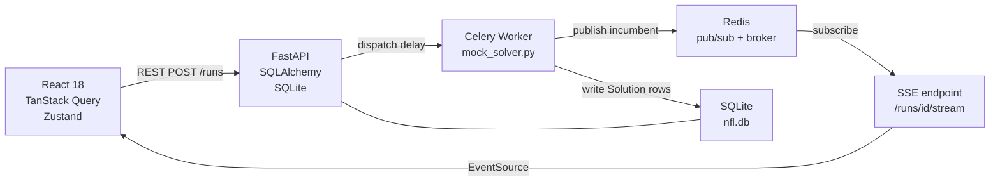

# async-solver-platform

Full-stack async optimization platform demonstrating a production-grade
**React + FastAPI + Celery + Redis** architecture for long-running compute
jobs with real-time browser updates via Server-Sent Events.

**While all the Machine Learning, Data Preprocessing, and Mixed Integer Programming in this repo represents my own work, this async-solver-platform was co-authored with Claude ai**

---

## Portfolio Note

This is a sanitized portfolio version of a production NFL schedule optimization
system. The proprietary components (a Gurobi MIP solver, production viewership
models, and confidential scheduling data) have been removed. In their
place, a **mock solver** replays pre-computed solutions from the real system,
preserving the exact shape of the async pipeline: task dispatch, incumbent
streaming, and live UI updates all work end-to-end.

The following are **not** present in this repo:

- Gurobi solver modules (25-file proprietary package)
- Production viewership prediction models
- Anonymized rules replace all real scheduling constraints
- Team names and matchup data are real NFL data (publicly available)

Everything else - the async task infrastructure, the React UI, the SSE event
bus, and the REST API - is real production-ready code.

---

## Architecture



**Request flow:**

1. User submits a run --> `POST /runs` creates a DB row (status=`queued`) and calls `dispatch_run.delay(run_id)`
2. Celery worker picks up the task --> status --> `building` --> `solving`
3. Mock solver replays pre-computed incumbents, writing each as a `Solution` row and publishing an `incumbent` event to Redis
4. FastAPI's SSE endpoint subscribes to `run:{run_id}` and forwards every event to the browser
5. React's `useRunDetail` hook consumes the EventSource stream and updates the incumbent table in real time without polling

---

## Tech Stack

| Layer          | Technology                                                                            |
| -------------- | ------------------------------------------------------------------------------------- |
| Frontend       | React 18, TypeScript, Vite, TanStack Query v5, Zustand, Tailwind CSS, React Router v6 |
| Backend        | FastAPI, SQLAlchemy 2.0 (ORM), Pydantic v2, SQLite                                    |
| Async          | Celery 5, Redis 7 (task broker + pub/sub event bus)                                   |
| Infrastructure | Docker (Redis container), uvicorn                                                     |

---

## Quick Start

```bash
# 1. Start Redis
docker compose up -d

# 2. Install and start the API
cd api
pip install -r requirements.txt
uvicorn app.main:app --reload --port 8001

# 3. Start the Celery worker (separate terminal, from api/)
celery -A app.worker.celery_app worker --loglevel=info

# 4. Install and start the frontend (separate terminal)
cd frontend
npm install
npm run dev
```

Open http://localhost:5173, select season **2025**, and launch a run from
the **Run** page. Switch to **History** to watch incumbents stream in live.

---

## How It Works

### Async Job Lifecycle

Every schedule optimization run is a long-running job (minutes to hours in
production). The system never blocks an HTTP request waiting for the solver.
Instead:

- `POST /runs` returns immediately with `status: queued`
- A Celery task executes the solver in a worker process
- The worker publishes progress events to a Redis pub/sub channel
- The browser streams events via a persistent SSE connection

Status transitions are: `queued -> building -> solving -> complete | failed | stopped`

### Real-Time Incumbent Streaming

Each time the MIP solver finds a better feasible solution (an "incumbent"),
the worker writes a `Solution` row and publishes an `incumbent` event:

```json
{
  "event": "incumbent",
  "incumbent_num": 42,
  "obj_value": 384.7,
  "solution_id": "...",
  "penalty_total": 31240.0,
  "ratings_total": 495000
}
```

The frontend's `useRunDetail` hook maintains an EventSource connection and
appends each incumbent to the table as it arrives (no polling, no page
refresh).

### Mock Solver

The mock solver (`api/app/worker/mock_solver.py`) replays incumbents from
two pre-computed template runs stored in the DB:

- **PenaltyOnly**: 97 incumbents over ~50 min real solve → ~3.7 min replay
- **MultiObjective**: 420 incumbents over ~3 hr real solve → ~7 min replay

Sleep between incumbents is scaled: `sleep = min(gap * multiplier, max_gap)`.
The multiplier and max-gap are configurable via the **Solver Config** page,
so you can watch the replay at any speed.

### Schedule Viewer

Each solution stores a `schedule_records_json` column: the full 18-week,
32-team game assignment as a flat list of `{week, slot, home, away}` objects.
The Schedule Viewer renders these into a color-coded grid using a `colorPolicy`
that maps broadcast slots to CSS classes (e.g., SNF → green, MNF → yellow). This color policy can be updated in the application's settings and schedules can be rendored with any colorPolicy.

### Run Cancellation

The cancel endpoint (`DELETE /runs/{id}`) calls `celery_app.control.revoke()`
with `terminate=True` to kill the worker process, then sets `status: stopped`.
The mock solver also checks a `threading.Event` stop flag between incumbents
so it exits cleanly without orphan threads.

---

## Key Design Decisions

**Why SQLite?** Simplicity for a portfolio demo, zero infrastructure. The ORM
layer (`SQLAlchemy`) means switching to Postgres in production requires only a
`DATABASE_URL` change.

**Why Redis for pub/sub instead of WebSockets?** The Celery worker is a
separate process from uvicorn. Redis pub/sub is the natural broker between
them. The SSE endpoint acts as a thin relay. It subscribes to `run:{id}` and
yields each message as an SSE frame. This keeps the worker stateless and
horizontally scalable.

**Why SSE instead of WebSockets?** SSE is unidirectional (server -> browser),
which matches the use case perfectly. It works through standard HTTP, survives
reverse proxies without special configuration, and is natively supported by
the browser `EventSource` API. No socket libraries are needed.

**Why Celery instead of asyncio tasks?** The real solver is CPU-bound and
blocks for hours. Celery with a dedicated worker process isolates the solve
from the uvicorn event loop. The mock solver preserves this separation even
though it only replays former solves.

---
