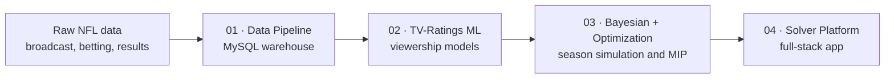

# Data Science, Machine Learning, Operations Research, and Software Engineering Portfolio

**Seth DeValve, Principle Software Engineer, Accelerait LLC**

Welcome to all engineers, hobbyists, and recruiters. This repo is my public portfolio. I keep it updated with the projects that I am particularly passionate about, and with work that I feel is interesting and pragmatic to a larger community of engineers.

The repo currently contains four connected projects that together build one system for predicting and optimizing
NFL playing & broadcasting schedules. Each project stands on its own, but read in order they form a
single pipeline: **(1)** raw data becomes a normalized SQL warehouse, **(2)** the warehouse is utilized to train machine
learning models in various frameworks, **(3)** the models feed a stochastic MILP optimizer (with a sidebar on Bayesian Statistics, Monte Carlo simulation, and a tuned season-simulator), and **(4)** the MILP optimizer is served
through a full-stack application.

The connective idea across all four: **Build a system that efficiently finds optimal playing and broadcasting schedules for proffessional sports**. "Optimal" here is defined as a schedule that achieves the highest TV viewership while managing competitve fairness through many rules/constraints that the League Office mandates. This is fundamentally a multi-objective Mixed Integer Programming problem, but one of the axis' of optimization requires accurate viewership predictions across all the decision variables. Such predictive models can only be reliably trained each week/year with a clean, self-managed data warehouse. And the optimization engine and schedule configuration need a UI/UX design to efficiently leverage the powerful mathematics that can solve this type of problem better and faster than any previous generation. The specific application for these technologies is secondary. The main purpose of the portfolio is to display how this interest of mine (I am a former NFL player) has refined my skillsets in data engineering, machine learning, operations research, and front-end engineering.

The Machine Learning models in project 2 are coded from scratch with minimal dependencies, including the neural networks. I acknowledge that there are more advanced frameworks for training neural nets (Pytorch, Tensorflow), however the projects posted here are built using standard NumPy. This doubled as an exercise for me to have to build each component from the ground up, resulting in a more complete understanding of this powerful technology. It turns out that neural nets are mostly linear algebra and partial derivitives, with some occasional fancy processing loops, but very far from SciFi.

## The system

## The four projects

| #   | Project                                                               | What it demonstrates                                                                                                                                                                                                                           |
| --- | --------------------------------------------------------------------- | ---------------------------------------------------------------------------------------------------------------------------------------------------------------------------------------------------------------------------------------------- |
| 01  | **[Data Pipeline](01-data-pipeline/)**                                | A normalized MySQL warehouse (star schema, idempotent ingest CLI, timezone and team-name reconciliation, leak-free feature engineering) that turns messy multi-source NFL data into one training-ready table.                                  |
| 02  | **[TV-Ratings ML](02-tv-ratings-ml/)**                                | A principled four-model comparison for predicting intra-market TV ratings: a from-scratch NumPy MLP, a from-scratch learned-embedding MLP, gradient boosting, and a regularized linear baseline, with SHAP and embedding-space interpretation. |
| 03  | **[Bayesian Simulation and Optimization](03-bayesian-optimization/)** | A Bayesian hierarchical season simulator whose calibrated win-probability samples feed a mixed-integer program that measures how schedule design affects late-season playoff contention.                                                       |
| 04  | **[Async Solver Platform](04-solver-platform/)**                      | A React, FastAPI, Celery, and Redis application that runs long optimization jobs asynchronously and streams live results to the browser over Server-Sent Events.                                                                               |

## Skills on display

- **Data engineering:** relational schema design, idempotent ETL, feature engineering with explicit leakage control.
- **Machine learning:** neural networks implemented from scratch, gradient boosting with hyperparameter optimization, regularized linear models, model interpretation and honest cross-model comparison. Continuous and binary targets.
- **Statistics and operations research:** Bayesian hierarchical modeling, uncertainty calibration, mixed-integer programming, deploying learned models inside an optimizer.
- **Software engineering:** full-stack TypeScript and Python, asynchronous task processing, real-time streaming, containerized services.

## A note on data

Several of these projects are built on proprietary, confidential data sources that
cannot be redistributed. Where that is the case, notebooks are committed with their
outputs so they can be read end to end, but will not run if cloned. The full stack application does run end to end, but with replays of live runs instead of leveraging live data. Each project's README states what is and is not runnable from this repository.
